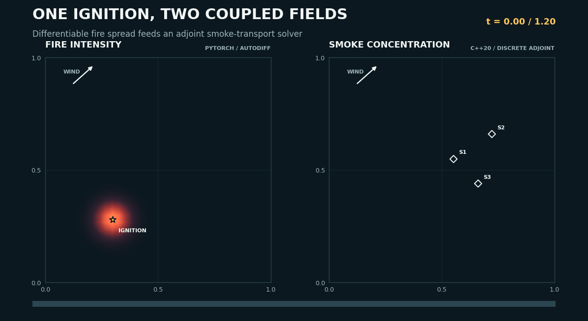
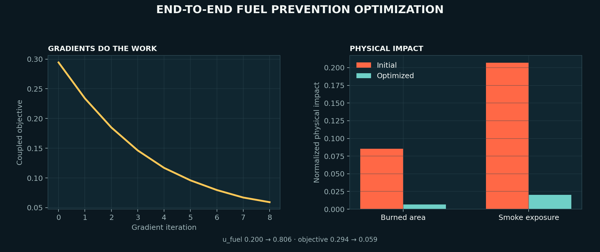
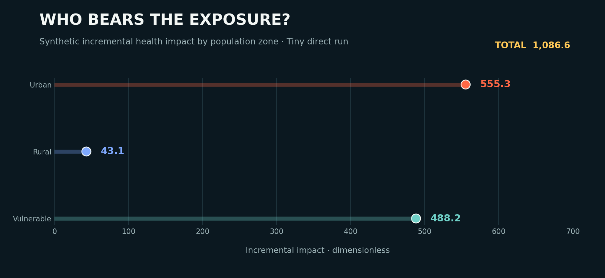
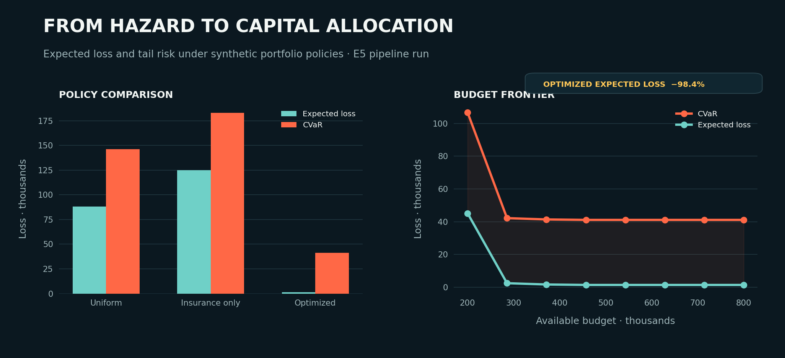

# ClimaCare-Risk

**Differentiable wildfire inference, fuel prevention, health exposure and resilience finance across PyTorch, C++ and JAX.**

ClimaCare-Risk was built for the [Tesseract Hackathon 2026](https://pasteurlabs.ai/tesseract-hackathon-2026/) in the **Differentiable inference & uncertainty quantification** track. It composes two heterogeneous Tesseracts into one differentiable scientific workflow:

- `fire_spread_torch`: reaction–diffusion–advection wildfire model in PyTorch, differentiated by PyTorch VJP;
- `smoke_transport_cpp`: C++20/OpenMP smoke transport model, differentiated by a hand-written discrete adjoint.

Health and finance are downstream JAX modules. The Tiny benchmark uses documented synthetic data so that the ground truth is known and gradients can be checked quantitatively. It is a research demonstrator, not an operational wildfire forecast, clinical model or financial recommendation.



## Why Tesseract is load-bearing

```text
physical parameters θ or prevention level u_fuel
                    │
                    ▼
┌────────────────────────────────┐
│ FireSpread Tesseract           │  PyTorch · native autodiff/VJP
└───────────────┬────────────────┘
                │ smoke source S[n,y,x]
                ▼
┌────────────────────────────────┐
│ SmokeTransport Tesseract       │  C++20/OpenMP · discrete adjoint
└───────────────┬────────────────┘
                │ sensor concentrations
                ▼
         JAX objective / loss
```

A single JAX function calls both containers through `tesseract_jax.apply_tesseract`. Reverse mode first invokes the C++ adjoint, then passes the smoke-source cotangent into the PyTorch VJP. The composed gradients are compared with centred finite differences in the test suite.

## Gradient-driven fuel prevention

The intervention experiment optimizes a continuous fuel-treatment level through both Tesseracts:

```text
u_fuel → fuel_prevention field → fire → smoke → coupled objective
```

The committed run starts from `u_fuel = 0.20` and reaches `0.806` in eight gradient steps:

| Metric | Initial | Optimized | Change |
|---|---:|---:|---:|
| Coupled objective | 0.2944 | 0.0592 | −79.9% |
| Burned-area fraction | 0.0855 | 0.0067 | −92.1% |
| Mean sensor smoke exposure | 0.2069 | 0.0201 | −90.3% |



The gradient of burned area and sensor smoke concentration with respect to `u_fuel` is finite, non-zero and agrees with centred finite differences.

## Inference, UQ and downstream decision support

The same composed pipeline supports:

1. direct fire→smoke simulation;
2. end-to-end gradient validation;
3. MAP reconstruction of ignition position, amplitude and wind correction;
4. Laplace uncertainty approximation and optional NumPyro NUTS;
5. downstream health impacts and CVaR portfolio analysis over posterior scenarios;
6. budget frontiers and wind, sensor-bias and budget-cut stress tests.

The portfolio optimizer is intentionally downstream: it optimizes continuous financial decisions over precomputed posterior physics scenarios. The fuel-prevention experiment above is the intervention that is optimized directly through both Tesseracts.





### Committed Tiny results

| Policy | Expected loss | CVaR | Capex |
|---|---:|---:|---:|
| Uniform | $88,182 | $146,466 | $180,000 |
| Insurance only | $124,847 | $183,093 | $150,000 |
| **Optimized downstream allocation** | **$1,393** | **$41,107** | $561,297 |

The real pipeline artifact is [`results/portfolio_e5_pipeline.json`](results/portfolio_e5_pipeline.json). The prevention artifact is [`results/prevention/prevention.json`](results/prevention/prevention.json).

## Repository structure

```text
app/climacare/
  pipeline.py        # FireSpread → SmokeTransport composition
  inverse.py         # gradient check and MAP
  uq.py              # Laplace approximation and NUTS
  prevention.py      # end-to-end u_fuel optimization
  health.py          # exposure and synthetic health impact
  finance.py         # downstream risk primitives
  cli.py             # reproducible experiment commands
components/tesseracts/
  fire_spread_torch/ # PyTorch Tesseract
  smoke_transport_cpp/ # C++/OpenMP Tesseract
components/shared_code/ # shared physical kernels
configs/tiny.yaml
scripts/             # portfolio, benchmark and visualization scripts
tests/               # unit and container integration tests
results/             # reproducible JSON artifacts
docs/mathematical_specification.md
```

The archived `archive/wildfire_prototype/` is an incomplete post-C0 real-data prototype and is not part of the reproducible submission pipeline.

## Installation

### Prerequisites

- Python 3.12+
- Docker Desktop
- Tesseract Core 1.11.0 and Tesseract-JAX 0.4.1
- GNU Make for the shortcuts below (or run the commands directly)

```bash
git clone https://github.com/lucasbertin06/ClimatCareRisk.git
cd ClimatCareRisk
python -m venv .venv
source .venv/bin/activate
pip install -e 'app[dev]' -e components/shared_code
```

### Local paths without Tesseract images

The synthetic portfolio path runs without Docker:

```bash
python -m climacare.cli portfolio --fake --output-dir results/portfolio_fake
```

The standalone plume inversion CLI exposes an explicit subcommand:

```bash
plume_inversion run --steps 120
```

The visual assets use the local PyTorch solver and compiled C++ smoke kernel:

```bash
make smoke-kernel
python scripts/generate_visualizations.py
```

Assets are written to `docs/assets/`. Use `--output-dir PATH` to render elsewhere.

### Full heterogeneous pipeline

Build and tag both Tesseract images:

```bash
make build-c0
```

On Windows, if `tesseract` is not on `PATH`:

```bash
make TESSERACT='C:/Users/Alexis/AppData/Local/Python/pythoncore-3.14-64/Scripts/tesseract.exe' build-c0
```

## Reproduce the experiments

```bash
# E1: direct fire→smoke run
python -m climacare.cli direct --output-dir results/tiny_direct

# E2/E3: gradient check and MAP inversion
python -m climacare.cli map --output-dir results/tiny_map

# E4: Laplace UQ, optionally NUTS
python -m climacare.cli uq --output-dir results/tiny_uq

# End-to-end intervention optimized through both Tesseracts
python -m climacare.cli prevention --output-dir results/prevention

# E5/E6: downstream portfolio and stress tests
python -m climacare.cli portfolio --output-dir results/portfolio

# Full test suite
python -m pytest tests -q
```

The test suite covers the local numerical kernels, direct composition, cross-component gradients, inversion, health calculations, smoke transport, fire spread, and portfolio loss structure. CI compiles and tests the local C++ smoke kernel explicitly; container-dependent tests run again after both Tesseract images are built.

Make shortcuts:

```bash
make tiny-direct
make tiny-gradient
make tiny-map
make test
```

## Rebuild the visual assets

```bash
python scripts/generate_visualizations.py
```

The GIF requires the locally compiled C++ smoke kernel (`make smoke-kernel`). If the GIF already exists, the script keeps it and regenerates the PNG result figures from the committed JSON artifacts.

## Scope and known limitations

- The submitted C0 case is synthetic and dimensionless by design.
- Health and economic coefficients are illustrative.
- The downstream portfolio optimizer uses precomputed posterior scenarios; only `u_fuel` is currently optimized directly through both physical Tesseracts.
- The sensor-bias stress may be absorbed by insurance and reserve in a well-funded portfolio; constrained-budget diagnostics are stored in the portfolio artifact.
- The archived real-data prototype depends on unavailable `wildfire_shared` modules and is future work.

For equations, stability conditions, adjoint definitions, likelihood and CVaR formulation, see [`docs/mathematical_specification.md`](docs/mathematical_specification.md).

## Tests

The test suite covers:

- FireSpread and SmokeTransport invariants;
- discrete-adjoint dot products;
- end-to-end VJP versus centred finite differences;
- prevention gradients through both Tesseracts;
- MAP, health, finance, scenario generation and stress tests.

Container-dependent tests are skipped when the required Docker images are unavailable.

## License

Apache License 2.0 — see [`LICENSE`](LICENSE).

## Team

- Marko Sinadinovic — scientific modeling and validation
- Antoine — HPC, kernels and inference
- Lucas (Volta) — sustainable finance, CVaR, resilience allocation and integration
